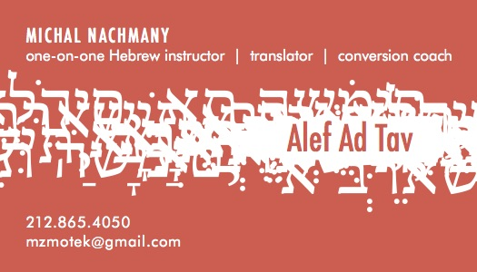
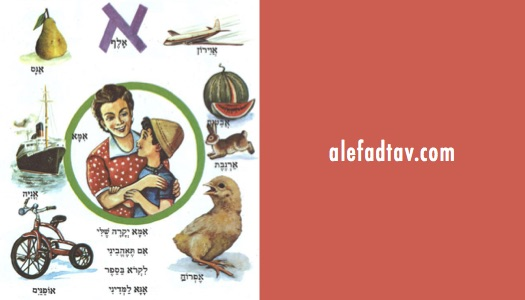

# Alef ad Tav: Learn Hebrew quickly with Michal Nachmany

## What is Alef ad Tav?

Alef ad Tav means A to Z in Hebrew.
Alef is the first letter of the alphabet, and tav is the last one. 
The first step of your journey is learning how to read the letters.
Then we tailor a program according to your needs and learning style.

Some of my students study prayerbook and biblical Hebrew with me.
Others study modern and spoken language.
Some students take an accelerated "marathon" course.
Others study in 8-10 week sessions.
Some prefer to study in a group, others one-on-one.

Alef ad Tav is more than just letters and vowels.
It is culture, warmth, and tea with fresh mint leaves.

[Listen to her Podcast](https://itunes.apple.com/us/podcast/rega-shel-ivrit-moment-hebrew/id468419206?mt=2)

## List of Services

* Group Lessons
* Private Lessons
* Hebrew Marathon
* Hebrew before Conversion
* Hebrew after Conversion
* Biblical Hebrew
* Modern Hebrew

### Hebrew Marathon

Want to feel more comfortable in the prayer service but feel inhibited because you can’t read Hebrew? Have you been meaning to learn the language but somehow never seemed to have the time? This unique seminar is perfect for you. Come for an intensive Hebrew marathon that will leave you wanting more. Learn the letters and vowels, and by the end of the day you will be reading Hebrew.

## About Michal Nachmany

MICHAL NACHMANY is a graduate of the Hebrew University of Jerusalem. She has taught liturgical, biblical and modern Hebrew for more than 20 years at synagogues and other institutions throughout New York City.

[Download her Resume](Michal Nachmany Resume Nov 2016.doc)
